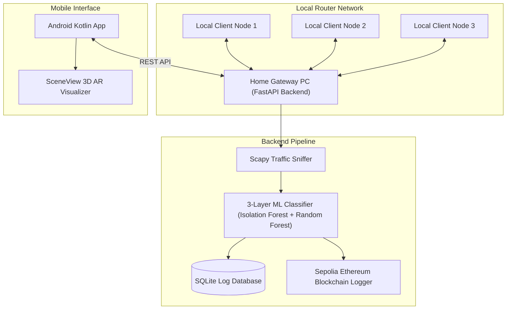

# Smart Home Firewall - Decentralized Intrusion Detection System

An advanced, high-performance security monitoring system for home local networks. It combines a Python FastAPI packet inspection backend with a 3-layer machine learning classification pipeline, blockchain event verification on the Sepolia Ethereum testnet, and an interactive Android client app featuring Jetpack Compose and 3D Augmented Reality (AR) visualizations.

---

## Architecture Overview



---

## Project Structure

### 1. Python Firewall Backend (`/smart-firewall`)
* **`src/api.py`**: The FastAPI server hosting REST API endpoints for login/registration, network node discovery, and threat statistics.
* **`src/firewall.py`**: Packet classification engine loading the 3-Layer Machine Learning pipeline (Isolation Forest anomalies, rule-based heuristics, and Random Forest threat confirmations).
* **`src/monitor.py`**: Local network packet sniffer leveraging Scapy to intercept and log raw flow parameters.
* **`src/blockchain_logger.py`**: Web3 integration signing and logging threat events to a Solidity smart contract on the Ethereum Sepolia Testnet.
* **`src/database.py`**: SQLite database controller storing historical alerts and admin authentication credentials.
* **`src/fl_server.py` & `src/fl_client.py`**: Decentralized Flower federated machine learning server and client configurations.
* **`src/generate_certs.py`**: Self-signed SSL certificate generation script for securing uvicorn endpoints over HTTPS.
* **`src/train_three_layer.py`**: Pipeline training script to tune and save the scikit-learn model files.
* **`requirements.txt`**: Complete Python package configurations list.

### 2. Jetpack Compose Android Client (`/ARapp`)
* **`ui/screens/`**: Jetpack Compose UI screens:
  * `LoginScreen.kt`: Cypher-themed gateway entry with robust IP format validation.
  * `DashboardScreen.kt`: Main portal showing connection states, weekly stats, and online network nodes.
  * `ThreatListScreen.kt`: Logs listing blockchain verification alerts with filter chips and search.
  * `ARScreen.kt`: Immersive SceneView AR overlay rendering 3D client nodes connected to the central gateway.
* **`ui/components/`**: Modular UI widgets (`StatCard`, `NodeCard`, `LiveThreatCard`, `ThreatDistributionBar`).
* **`data/api/ApiService.kt`**: Retrofit definitions supporting dynamic gateway IP targeting.

---

## Getting Started

### 📋 Prerequisites
The host computer must have **Npcap** installed to sniff Wi-Fi/Ethernet packets:
1. Download and run the [Npcap 1.x Installer](https://npcap.com/#download).
2. Keep default options checked during installation.
3. Restart your PC.

---

### Option A: Running from Pre-Compiled Releases (Easiest)
*No Python installation or command-line usage required. Recommended for clients and presentations.*

1. Go to the **Releases** tab of this repository and download **`smart-firewall-release.zip`**.
2. Extract the `.zip` archive on your Windows PC.
3. The release contains a pre-configured `.env` file with working default Sepolia testnet credentials. You can use these out-of-the-box or open it in Notepad to add your own keys.
4. Double-click **`api.exe`** to start the secure HTTPS server.
5. Double-click **`firewall.exe`** to start the active machine learning sniffer.

---

### Option B: Running from Source Code (Developer Setup)
*Requires Python 3.9 - 3.11 installed.*

1. **Clone the Repository**:
   ```bash
   git clone https://github.com/methma0422/Smart_firewall.git
   cd Smart_firewall
   ```
2. **Setup the Virtual Environment**:
   Double-click the **`setup_env.bat`** file. This automatically configures your Python virtual environment (`venv`) and installs the required libraries.
3. **Download or Train ML Models**:
   Because `.pkl` models exceed GitHub's 100MB file limit, they are git-ignored. You must copy the models into `smart-firewall/model/` or place raw datasets in `smart-firewall/data/` and re-train them:
   ```bash
   python smart-firewall/src/train_three_layer.py
   ```
4. **Start the Services**:
   * Double-click **`Run_API_Gateway.bat`** to start the HTTPS API.
   * Double-click **`Run_ML_Sniffer.bat`** to start the live ML Packet sniffer.

---

### 3. Compile & Launch Android Client
1. **Transfer and Install the APK**:
   * Transfer and install **`Smart_Home_Firewall.apk`** to your phone. 
   * If installing via USB or Google Drive, click **Settings** on the warning prompt and select **Allow from this source** to authorize sideloading.
2. **Compile from source (Optional)**:
   * Open the `/ARapp` directory in Android Studio.
   * Build and deploy the application to your phone or compile using gradle:
     ```bash
     ./gradlew assembleDebug
     ```
3. **Connect to Backend**:
   Ensure your phone is on the same Wi-Fi network as the PC. Enter your PC's local Wi-Fi IPv4 address (e.g. `192.168.1.15`) into the login input field to connect!

---

## 📊 3-Layer ML Architecture Details

```
           Incoming Packet Flow
                   │
                   ▼
  ┌─────────────────────────────────┐
  │  Layer 1: Isolation Forest      │  ◄── Unsupervised baseline anomalies
  └────────────────┬────────────────┘
                   │
                   ├───────────────────┐
                   ▼ (Anomalous)       ▼ (Normal)
  ┌─────────────────────────────────┐  │
  │  Layer 2: Heuristic Signature   │  │  ◄── SYN Flood, PortScan rules
  └────────────────┬────────────────┘  │
                   │                   │
                   ├───────────┐       │
                   ▼ (Alert)   ▼ (Ok)  ▼
  ┌─────────────────────────┐  │       │
  │ Layer 3: Random Forest  │  │       │  ◄── High/Medium risk triage
  └────────────┬────────────┘  │       │
               ▼               ▼       ▼
        Confirmed Threat   Suspicious  Normal
```

---

## 🛠️ Troubleshooting

* **`Unable to parse TLS packet header` (on Mobile App)**:
  This means `api.exe` fell back to unencrypted HTTP because the SSL certificates (`ssl_key.pem` & `ssl_cert.pem`) are missing. Copy the `.pem` files from `smart-firewall/` to your executable directory and restart `api.exe`.
* **`[Errno 10048] Socket address already in use`**:
  An old instance of the API server is still running in the background. Close all open terminal windows, wait 5 seconds, and run it again.
* **Blockchain Warning: Insufficient Sepolia ETH balance**:
  If the wallet address in your `.env` does not have testnet Sepolia ETH, transactions cannot be mined. The code automatically prints a warning and generates simulated hashes so the mobile client can still verify threat flows.
