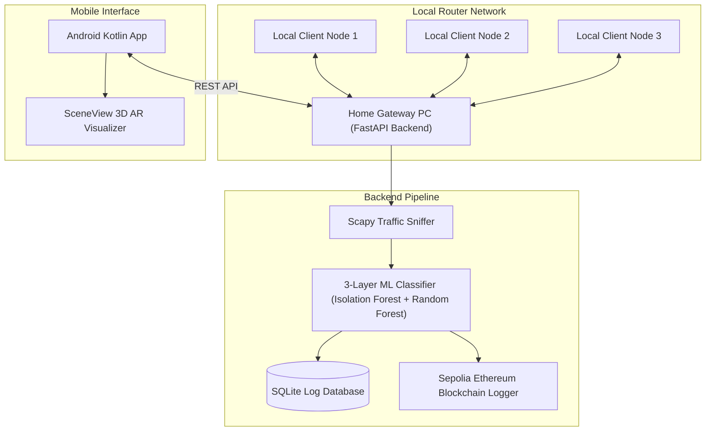

# Smart Home Firewall - Decentralized Intrusion Detection System

An advanced, high-performance security monitoring system for home local networks. It combines a Python FastAPI packet inspection backend with a machine learning classification pipeline, blockchain event verification, and an interactive Android client app featuring Jetpack Compose and 3D Augmented Reality (AR) visualizations.

---

## Architecture Overview



---

## Project Structure

### 1. Python Firewall Backend (`/smart-firewall`)
- **`src/api.py`**: The FastAPI server hosting endpoints for logins, scan requests, network node discovery, and threat stats.
- **`src/firewall.py`**: Packet classification engine loading the 3-Layer Machine Learning pipeline (Isolation Forest anomalies, Rule-based checks, Random Forest threat classifications).
- **`src/monitor.py`**: Local network sniffer leveraging Scapy to filter and log suspicious packets.
- **`src/blockchain_logger.py`**: Smart contract integration signing and storing alerts on the Sepolia Ethereum testnet.
- **`src/database.py`**: Local SQLite database management module storing historical alerts.
- **`src/fl_server.py` & `src/fl_client.py`**: Decentralized Flower federated machine learning server and client nodes configuration.
- **`requirements.txt`**: Complete Python package configurations list.

### 2. Jetpack Compose Android Client (`/ARapp`)
- **`ui/screens/`**: High-performance UI screens:
  - `LoginScreen.kt`: Cypher-themed security access portal with robust input IP validations.
  - `DashboardScreen.kt`: Central hub displaying network stats, gateway active states, weekly threat counts, and live nodes list.
  - `ThreatListScreen.kt`: Real-time log listing blockchain verification logs with filter chips and live search.
  - `ARScreen.kt`: Immersive SceneView AR overlay rendering 3D client nodes floating in local physical space connected to the router gateway.
- **`ui/components/`**: Highly modular and reusable UI widgets (`StatCard`, `NodeCard`, `LiveThreatCard`, `ThreatDistributionBar`).
- **`data/api/ApiService.kt`**: Retrofit definitions with dynamic gateway re-targeting features.

---

## Getting Started

### 1. Run Python API Backend
1. Navigate to the backend directory:
   ```bash
   cd smart-firewall
   ```
2. Activate your virtual environment and install dependencies:
   ```bash
   venv\Scripts\activate
   pip install -r requirements.txt
   ```
3. Start the FastAPI server on port 8000 (listening on all network interfaces):
   ```bash
   python src/api.py
   ```

### 2. Compile & Launch Android Client
1. Open the `/ARapp` directory in Android Studio.
2. Ensure your phone and the host PC are on the same Wi-Fi network.
3. Build and deploy the application to your phone or run a gradle compilation:
   ```bash
   ./gradlew assembleDebug
   ```
4. Enter your host PC's Wi-Fi IPv4 address (e.g., `192.168.1.4`) into the login gateway input field to connect!
